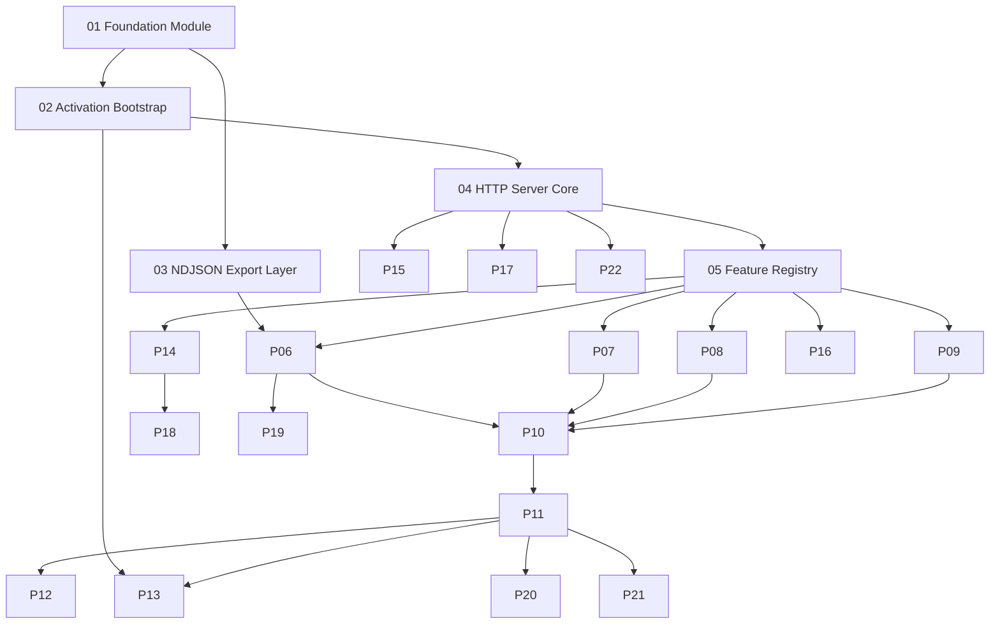

# DebugSwift AI Automation — Implementation Plans

Step-by-step implementation plans derived from [AI_AUTOMATION.md](../AI_AUTOMATION.md).

Each plan is self-contained: goal, prerequisites, file touch list, tasks, acceptance criteria, and verification commands.

## Integration branch: `epic/v3`

All AI automation work (Plans 01–22) merges into **`epic/v3`**. That epic branch is the long-lived integration line for v3; it lands in `develop` when the full epic is done.

### Branching model

```
develop
  └── epic/v3                          ← integration target for all AI plans
        ├── maatheusgois-dd/ai/01-foundation
        ├── maatheusgois-dd/ai/02-bootstrap
        ├── maatheusgois-dd/ai/03-ndjson
        └── … (one PR per plan, or batch P0 as single PR)
```

| Rule | Detail |
|------|--------|
| **Base branch for PRs** | `epic/v3` (not `main` / `develop`) |
| **PR target** | `epic/v3` |
| **Assignee** | `maatheusgois-dd` |
| **PR state** | Draft until smoke test passes |
| **Epic completion** | Single PR: `epic/v3` → `develop` |

### Suggested PR batches

| PR | Plans | Rationale |
|----|-------|-----------|
| `ai/p0-core` | 01–05 | Foundation compiles; empty `/status` |
| `ai/p0-exporters` | 06–11 | MVP logs + HTTP API |
| `ai/p0-tooling` | 12–13, 22 | Scripts, Example, security baseline |
| `ai/visual` | 14–16 | Screenshots + actions |
| `ai/advanced` | 17–20 | Resources, device parity |
| `ai/mcp` | 21 | MCP package (may live outside this repo) |

Docs-only changes (this folder + `AI_AUTOMATION.md`) can go directly to `epic/v3` or ship first as `maatheusgois-dd/ai/plans`.

### Create the epic branch (once)

```bash
git fetch origin develop
git checkout -b epic/v3 origin/develop
git push -u origin epic/v3
```

## Dependency graph



## Phase 0 — Prep

| Step | Plan | Status |
|------|------|--------|
| 0 | [13 — Example Integration](./13-example-integration.md) | Partial (scheme env vars pending) |

## Phase 1 — P0 MVP (data features)

| Step | Plan | Delivers |
|------|------|----------|
| 1 | [01 — Foundation Module](./01-foundation-module.md) | `DebugSwift.AI` public surface, export dir |
| 2 | [02 — Activation Bootstrap](./02-activation-bootstrap.md) | Env/launch-arg detection, `bootstrap()` |
| 3 | [03 — NDJSON Export Layer](./03-ndjson-export-layer.md) | Shared writer, envelope schema |
| 4 | [04 — HTTP Server Core](./04-http-server-core.md) | Localhost server, routing, auth token |
| 5 | [05 — Feature Registry](./05-feature-registry.md) | String IDs → existing APIs |
| 6 | [06 — Network Export](./06-network-export.md) | `network.jsonl`, body truncation |
| 7 | [07 — Console Export](./07-console-export.md) | `console.jsonl` + StdoutCapture hook |
| 8 | [08 — Performance Export](./08-performance-export.md) | `performance.jsonl` 1 Hz sampler |
| 9 | [09 — Leaks & Crashes Export](./09-leaks-crashes-export.md) | `leaks.jsonl`, `crashes.jsonl` |
| 10 | [10 — Status Endpoint](./10-status-endpoint.md) | `GET /status`, `status.json` |
| 11 | [11 — Logs & Features API](./11-logs-features-api.md) | `POST /features/*`, `GET /logs/*` |
| 12 | [12 — Shell Scripts](./12-shell-scripts.md) | `scripts/ai-tail-logs.sh`, helpers |
| 13 | [13 — Example Integration](./13-example-integration.md) | Scheme, README, smoke test |

## Phase 2 — Visual + actions

| Step | Plan | Delivers |
|------|------|----------|
| 14 | [14 — Interface Visual Features](./14-interface-visual-features.md) | Grid, touch, colorize, HUD toggles |
| 15 | [15 — Screenshot Endpoint](./15-screenshot-endpoint.md) | `GET /screenshot`, labeled PNGs |
| 16 | [16 — Actions API](./16-actions-api.md) | push, deeplink, location, debugger UI |

## Phase 3 — Advanced

| Step | Plan | Delivers |
|------|------|----------|
| 17 | [17 — Resources Endpoints](./17-resources-endpoints.md) | Files, UserDefaults, cookies JSON |
| 18 | [18 — View Hierarchy Export](./18-view-hierarchy-export.md) | `view-hierarchy.json` |
| 19 | [19 — Network Injection API](./19-network-injection-api.md) | Delay/fail/rewrite rules |
| 20 | [20 — Device Parity](./20-device-parity.md) | devicectl, LAN HTTP, device screenshots |

## Phase 4 — MCP + hardening

| Step | Plan | Delivers |
|------|------|----------|
| 21 | [21 — MCP Package](./21-mcp-package.md) | `@debugswift/mcp`, Cursor config |
| 22 | [22 — Security Hardening](./22-security-hardening.md) | DEBUG gate, token, body limits |

## Suggested build order

1. **Week 1:** 01 → 02 → 03 → 04 → 05 (skeleton works, `curl /status` returns empty state)
2. **Week 2:** 06 → 07 → 09 → 08 → 10 → 11 (P0 logs + toggles)
3. **Week 3:** 12 → 13 → 22 (scripts, Example, security baseline)
4. **Week 4+:** 14 → 15 → 16 → 17 → 18 → 19 → 20 → 21

## Out of scope (future CLI)

The `debugswift` brew CLI from AI_AUTOMATION.md is a thin wrapper over simctl + curl. Defer until Phase 1–2 HTTP API is stable; scripts in step 12 cover the gap.
